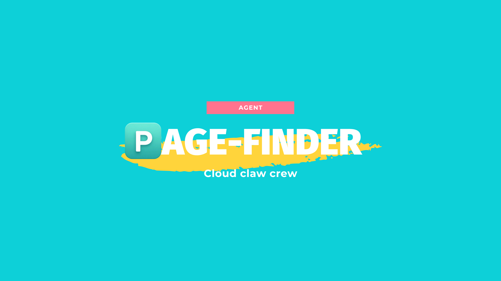

# Pagefinder

A RAG-powered chat agent that makes your Confluence knowledge base instantly searchable and always up to date.

## Demo
Link youtube: https://www.youtube.com/watch?v=XguYGxfrL94

**Try it live:** https://endpoint-a469d99f-1eda-4c3a-8453-6beeb52a7bf1.agentbase-runtime.aiplatform.vngcloud.vn/

---

## Problem

Organizations using Confluence face a common challenge: internal documentation grows large but becomes hard to navigate. Team members spend time sifting through hundreds of wiki pages to find specific information. They often don't know what has changed since they last visited a page, leading to decisions made on outdated documentation. There is no central way to ask cross-page questions or get a synthesized answer from scattered content.

---

## Users

The primary users are members of technical or business teams who regularly rely on Confluence as their source of truth:

- **Engineers** looking up runbooks, API specs, architecture decisions, and technical guidelines
- **Product managers and analysts** tracking process changes, requirement updates, and business documentation
- **New team members** onboarding and navigating an unfamiliar knowledge base
- Anyone who needs fast, accurate answers without manually searching through Confluence

---

## Solution

Pagefinder operates on a RAG (Retrieval-Augmented Generation) model powered by an OpenAI-compatible LLM (configurable via `LLM_MODEL`). It combines two complementary search strategies to retrieve the most relevant content:

- **Semantic search (KNN)** — finds content by meaning, not just exact words (42% of the hybrid score)
- **Keyword search (FTS5)** — matches lexical terms for precise recall (38% of the hybrid score)
- **Metadata boost** — promotes results by title, heading, and phrase relevance (20% of the hybrid score)

The index is built from chunked Confluence pages with embedding vectors stored in SQLite via `sqlite-vec`. An incremental background sync keeps the index fresh automatically — only pages whose version changed are reindexed, minimizing Confluence API calls. A full forced rebuild is also available when needed.

Pagefinder supports indexing entire Confluence spaces (via `CONFLUENCE_SPACE_KEYS`) and explicit page lists (via `CONFLUENCE_PAGE_IDS`), unioned together on every sync.

---

## Features

| Feature | Description |
|---|---|
| **Natural language Q&A** | Ask questions in plain language; receive answers with source references to the original Confluence pages |
| **Document listing** | List all currently indexed documents |
| **Full page read** | Fetch and return the complete content of any indexed page |
| **Change tracking** | See all documents that changed since your last update check, without triggering a Confluence sync |
| **Page diff** | View the latest diff for a specific page — what was added, removed, or modified |
| **Incremental sync** | Reindex only pages whose version has changed since the last sync |
| **Full rebuild** | Force a complete re-index of all pages regardless of version |
| **Document notes** | Add and retrieve personal notes attached to a specific page (requires AgentBase Memory) |
| **Reading history** | View your own reading history across sessions |
| **Personal memory** | Store and recall personal preferences or facts across conversations (requires AgentBase Memory) |

---

## Benefit

Pagefinder delivers a significant reduction in time spent searching for information. Teams stay informed of the latest documentation updates without needing to actively monitor Confluence. This helps accelerate decision-making and reduces the risk of acting on outdated information — especially in fast-moving projects where documentation changes frequently.

---

## Development

See [DEVELOPMENT.md](./DEVELOPMENT.md) for setup instructions, environment configuration, and architecture details.
